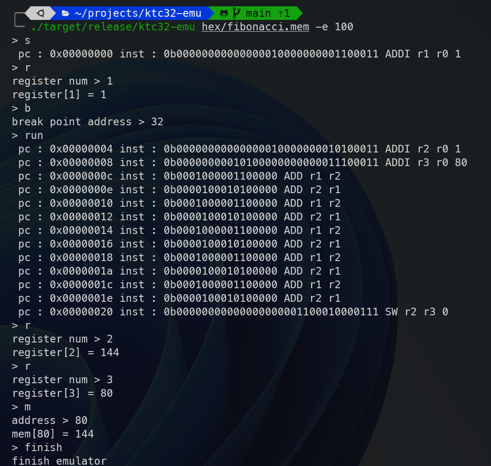

# ktc32-emu

[](https://github.com/kinpoko/ktc32-emu/actions/workflows/rust.yml)


[KTC32](https://github.com/kinpoko/ktc32) emulator written in Rust.

## Usage

```bash
USAGE:
    ktc32-emu --end-of-address <END_OF_ADDRESS> <FILE_PATH>

ARGS:
    <FILE_PATH>

OPTIONS:
    -e, --end-of-address <END_OF_ADDRESS>
    -h, --help                               Print help information
    -V, --version                            Print version information
```

## Screenshot


